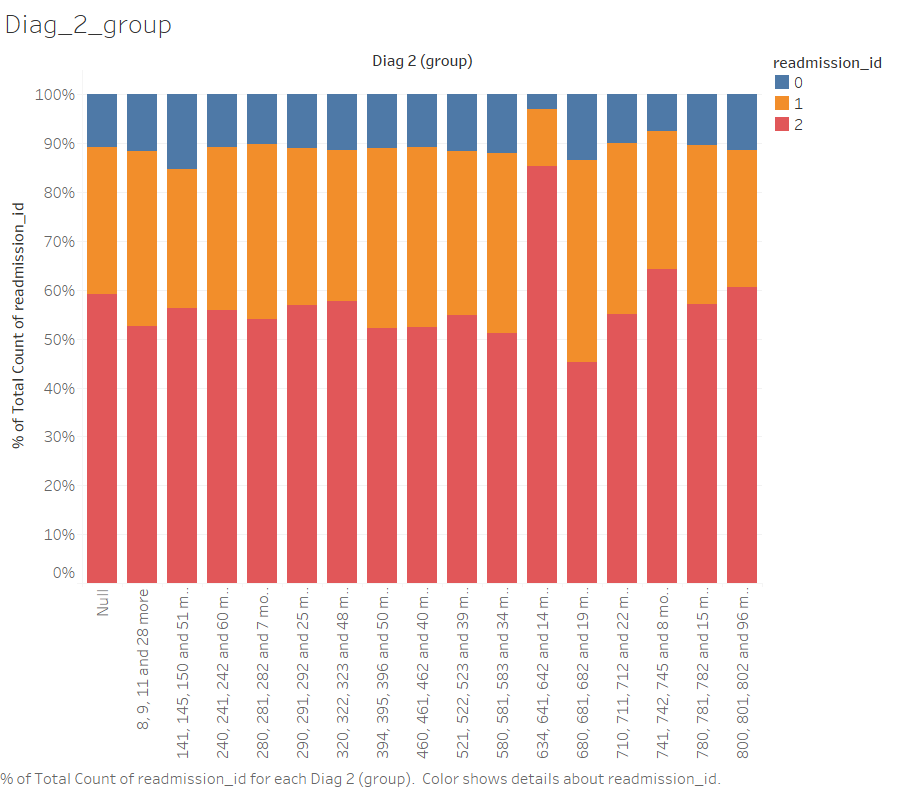
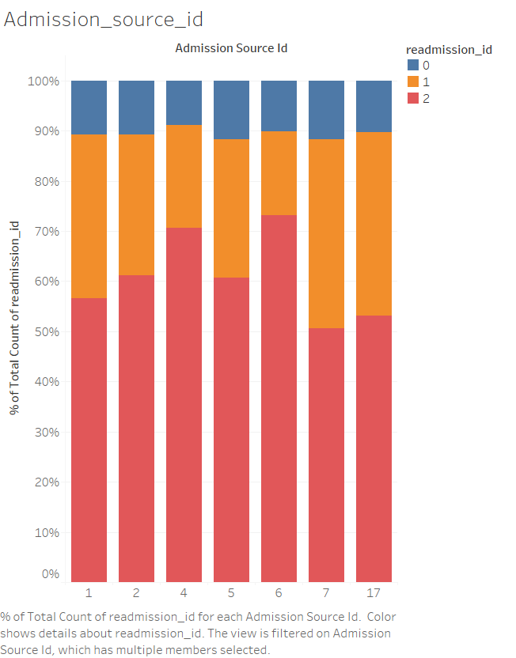

# ML Assignment 1 Report - OBSIDIAN 
## Canadian Hospital Readmittance Challenge

1. Siddharth Kothari (IMT2021019)
2. Sankalp Kothari (IMT2021028)
3. M Srinivasan (IMT2021058)

This is the report for us ML assignment-1. We had to train an ML model that will predict Canadian patients re-admittance in hospital. We had implemented various classification models such as Random-Forests, Decision trees, Gradient-Boosting etc. The best model that we could come up was Gradient Boosting. We had done extensive EDA for the dataset to make our model as good as possible.

### Dataset Description -
The instances represent the hospitalized patients as recorded in the hospitals in Canada. Each row has about 50 columns corresponding to it. Details include the age range, weight, gender, race, etc. The description of some of the important columns are mentioned in detail below:-

* **age**: Age of the person grouped in 10-year intervals - [0, 10), [10, 20),…, [90, 100)
* **admission_type_id**: Integer identifier corresponding to 9 distinct values, for example, emergency, urgent, elective, newborn, and not available.
* **number_outpatient/inpatient**: Number of outpatient or inpatient visits of the patient respectively in the year preceding the encounter.
* **number_diagnoses**: Number of diagnoses entered to the system.
* **Days to inpatient readmission**: 0, if the patient was readmitted in less than 30 days, 1 if the patient was readmitted in more than 30 days, and 2 for no record of readmission.

Along with the above columns there are columns that correspond to each individual medicines. The have the following as categorical data:-
The feature indicates whether the drug was prescribed or there was a change in the dosage. Values: up if the dosage was increased during the encounter, down if the dosage was decreased, steady if the dosage did not change, and no if the drug was not prescribed.

### EDA and Preprocessing - 

#### NULL removal - 

We first see the percentage of null values in each of the columns, to see which columns we can immediatelty drop.
We see that the following columns have a very large number of null values - 

1. Weight (96.84)
2. A1Cresult (83.32)
3. max_glu_serum (94.77)

We thus try to see the distribution of the values in these columns to see whether any useful info can be gained.

```
df['max_glu_serum'].value_counts()
```
The output was as follows : 
```
Norm    1790
>200    1034
>300     897
Name: max_glu_serum, dtype: int64
```
Similarly for the other 2 columns

#### Dropping Columns

Since no useful info can be gained from these columns, we drop them altogether.

We also drop columns which do not seem to be relevant to the readmission of a patient, such as payer code.

#### Medical Specialty

For the medical specialty column, we do not directly drop it, as some specialists' partients may have more chance of being readmitted than others'. Hence to tackle null values there, we impute the null values with a new value - "No-admitting-Physician".

This assumption is supported by the image below


```
df["medical_specialty"].fillna("No-Admitting-Physician", inplace=True)
```

#### Diag Groupings

The columns for diag_1, diag_2, diag_3 have a lot of categorical values, which we have grouped referring to the following website listing the groupings of ICD codes.

https://en.wikipedia.org/wiki/List_of_ICD-9_codes

We decided to drop the diag_1 column, and keep the other two, based on the following plots made in Tableau, which show the variation of the data with the columns. Readmission_id did not vary much with diag_1, hence we dropped it.





Another possibility we had considered was to drop diag_1, diag_2, diag_3 altogether, and instead replace it with a new column, which captures some of the information of the columns. However this did not bring about better results, so we dropped it.

#### Race and Gender

Finally, using the plots below, we realised that the race and gender of the person did not affect the values of readmission_id observed, hence we felt it better to drop these two columns.

Our claims are supported by the charts below.


### Engineering new features

We also made some new features which we thought would better capture the data. 

1. Admission_type_id_new - here we grouped the various values in the columns as given in admission_grouping_dict to reduce the number of categories.
2. Discharge_type_id_new - similar as previous. We grouped them based on which categories broadly fell into the same umbrella according to our understanding. 
3. Admission_source_id_new - similar as previous.
   
We engineer certain features like service utilization,
which is simply number outpatient + number inpatient + number emergency. We have made this feature as it
will be useful to see the total number of visits that a
person has had and that would be a good indicator of
seeing if a person was readmitted.

For the ages, we simply took the mean value of each
range as the value, hence converting the string values to
integers. We thought age should be a numerical variable
instead of a textual/categorical variable.

We then counted the number of records for a particular patient\_id across both the training and test data, and made that into a feature called patient\_id\_new.
```
patient = df['patient_id'].value_counts()
patient = patient.add(test_df['patient_id'].value_counts(),fill_value=0)
patient

def id_convertor(row):
    return patient[row['patient_id']]

new_col = df.apply(id_convertor, axis=1)
df.insert(loc = len(df.columns)-1, column = 'patient_id_new', value=new_col)
df.drop(columns=['patient_id'],inplace=True)
df.drop(columns=['enc_id'], inplace=True)

new_col = test_df.apply(id_convertor, axis=1)
test_df.insert(loc = len(test_df.columns), column = 'patient_id_new',
value=new_col)
test_df.drop(columns=['patient_id'], inplace=True)
test_df.drop(columns=['enc_id'], inplace=True)
```

#### Drug manipulations

We realised that for a lot of patients, many of the drugs mentioned are either not administered, or their dosage has not been changed. Hence we first count the number for each of the drugs.
```
metformin
Down        392
No        57223
Steady    12885
Up          736
Name: age, dtype: int64
repaglinide
Down         33
No        70145
Steady      980
Up           78
Name: age, dtype: int64
nateglinide
Down          8
No        70770
Steady      444
Up           14
Name: age, dtype: int64

...

change
Ch    32997
No    38239
Name: age, dtype: int64
diabetesMed
No     16360
Yes    54876
Name: age, dtype: int64
```

We then see that the following drugs have a very small number of records where the dosage of a drug has been changed, and as such it won't contribute much to the model. Hence we remove the following drugs - 
1. chlorpropamide
2. tolbutamide
3. miglitol
4. acarbose
5. tolazamide
6. acetohexamide
7. troglitazone
8. examide
9. citoglipton
10. glipizide-metformin
11. glimepiride-pioglitazone
12. metformin-rosiglitazone
13. metformin-pioglitazone
14. glyburide-metformin

We check if the dosage of that drug was changed, i.e., the dosage went Up or Down, and counted the number of columns for
which this change was observed, into a new column called changes. All the drug columns are now removed.
```
def count_changes(row):
    count =0
    for col in ['metformin','repaglinide','nateglinide','glimepiride',
                'glipizide','glyburide','pioglitazone','rosiglitazone',
                'insulin']:
        if(row[col]=='Up' or row[col]=='Down'):
            count+=1
    return count

new_col = df.apply(count_changes, axis=1)
df.insert(loc = len(df.columns)-1, column = 'changes', value=new_col)

df.drop(columns=['metformin','repaglinide','nateglinide','glimepiride',
                'glipizide','glyburide','pioglitazone','rosiglitazone',
                'insulin','change'], inplace=True)
```

Based on the following plots, we also considered dropping the following columns, as they didn't seem to affect the distribution of readmission_id.

1. num_procedures
2. time_in_hospital


But that led to a decrease in accuracy, so we didn't end up doing this.

### Data Visualization 

We plotted the following plots to get a better idea as to how the data affects readmission_id.
 
1. Scatterplot matrix between the various numeric features. The code for it has been commented out below, as it takes considerable amount of time to run. The plot has been downloaded and displayed below.
2. Covariance plot between the various numeric features and readmission_id. The code for the same is available below, and it is also commented out.  
3. Stacked bar charts for categorical variables, similar to the ones shown previously. They have been attached as well.




The other plots can be found in the images directory. We weren't able to infer much from them, and hence they weren't included in the report.

### Model fitting 

We tried out various combinations of models for the data. Before that, we first carried out a few steps - 

1. We standard scaled the numerical columns.
2. We one-hot encoded all the categorical columns with 3 or more categories. This led to certain columns which were there in the test data but not in the training data (as some categories appeared only in the test data), and some others which were only available in the training data.
3. To handle this, we do the following - add all columns from the train data not present in the test data with all values as zero, while the columns in the test data not available in the test data are simply dropped. We then sort the columns based on name to ensure correct ordering in training and testing data.
4. We then do a train test split with the test size as 0.2, and proceed to fit the models.
5. We also tried introducing polynomial features, but it decreased the performance of the model, so we removed it.

We tried various ML models possible for this task for eg. Logistic Regression, Naive-Bayes, Gaussian, Random-Forests, Decision-Trees, Gradient-Boosting, XGBoost etc. The best one we got till now was with Gradient Boosting and the accuracy score was coming around to be around 0.712029. The accuracy score for each of the ML Model is listed in the table below.

| Model | CV Score |
| ----- | -------- |
| Logistic Regression | 0.6647248736664795 | 
| Gaussian Naive Bayes | 0.16282987085906794 | 
| Decision Tree | 0.6530039303761932 |
| Random Forest | 0.7114682762492981 |
| XGBoost (Gradient Boosting) | 0.7120297585626053 | 

The hyper parameters for the Random Forest and Gradient Boosting Classifiers were determined using optuna. We ran nearly 15 instances of each, using a range of hyper parameter values, and then selected the ones which gave best results.

Since the cross-validation accuracy scores for both the classifiers were very similar, we submitted both on Kaggle after taking predictions on the test data.

The RF classifier gave score of 0.717, while the Gradient Boosting (xgboost) classifier gave a prediction accuracy score of 0.72. Hence we decided to use that as the final submisison on kaggle.

We finally plot the confusion matrix : 


### References
1. List of ICD-9 codes : https://en.wikipedia.org/wiki/List_of_ICD-9_codes
2. Optuna documentation : https://optuna.readthedocs.io/en/stable/
3. Pandas documentation : https://pandas.pydata.org/docs/
4. Numpy documentation : https://numpy.org/doc/1.26/user/index.html
5. Matplotlib.pyplot documentation : https://matplotlib.org/stable/users/index.html
6. Scikit learn documentation : https://scikit-learn.org/stable/
7. Seaborn documentation : https://seaborn.pydata.org/tutorial.html
8. Plotly documentation : https://plotly.com/python/plotly-fundamentals/
