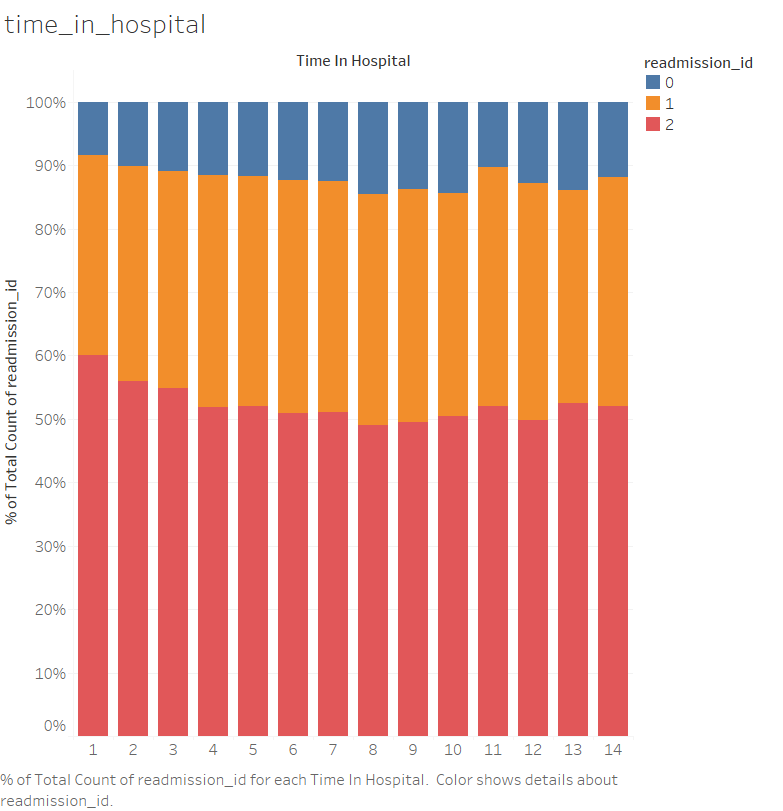

# ML Assignment 2 Report - OBSIDIAN 
## Canadian Hospital Readmittance Challenge

1. Siddharth Kothari (IMT2021019)
2. Sankalp Kothari (IMT2021028)
3. M Srinivasan (IMT2021058)


## Overview

This report contains the development of a hospital readmission prediction model using SVMs and neural network (implemented in PyTorch). The goal is to predict whether a patient will be readmitted to the hospital based on various features related to their health and medical history.

The best model that we could come up was with Neural Networks(with comparision to SVMs and Neural Networks).

We had used the same pre-processing as done for the previous assignment for the second part of the assignment. 

Some features of the preprocessing done in the previous assignment are - 

1. Removal of columns with high null percentages such as weight, max_glu_serum, A1C_result, and irrelevant columns such as payer_code.
2. Replacing null values in medical specialty with a new value.
3. Grouping in the diag_1, diag_2 and diag_3 columns, and the admission_type_id, discharge_disposition_id and admission_source_id columns.
4. Dropping columns such as race and gender.
5. Engineering new features such as patient_id_new, service_utilization, and changes.
6. Dropping the drug columns after recording relevant changes in drug doses.

We had used Neural Network with Adam optimizer for the same and the results of the prediction were same as that of RandomForests / Xgboost.

### Dataset Description -
The instances represent the hospitalized patients as recorded in the hospitals in Canada. Each row has about 50 columns corresponding to it. Details include the age range, weight, gender, race, etc. The description of some of the important columns are mentioned in detail below:-

* **age**: Age of the person grouped in 10-year intervals - [0, 10), [10, 20),…, [90, 100)
* **admission_type_id**: Integer identifier corresponding to 9 distinct values, for example, emergency, urgent, elective, newborn, and not available.
* **number_outpatient/inpatient**: Number of outpatient or inpatient visits of the patient respectively in the year preceding the encounter.
* **number_diagnoses**: Number of diagnoses entered to the system.
* **Days to inpatient readmission**: 0, if the patient was readmitted in less than 30 days, 1 if the patient was readmitted in more than 30 days, and 2 for no record of readmission.

Along with the above columns there are columns that correspond to each individual medicines. The have the following as categorical data:-
The feature indicates whether the drug was prescribed or there was a change in the dosage. Values: up if the dosage was increased during the encounter, down if the dosage was decreased, steady if the dosage did not change, and no if the drug was not prescribed.

## Preprocessing Description

#### NULL removal - 

We first see the percentage of null values in each of the columns, to see which columns we can immediatelty drop.
We see that the following columns have a very large number of null values - 

1. Weight (96.84)
2. A1Cresult (83.32)
3. max_glu_serum (94.77)

Since no useful info can be gained from these columns, we drop them altogether.
We also drop columns which do not seem to be relevant to the readmission of a patient, such as payer code.

#### Medical Specialty

For the medical specialty column, we do not directly drop it, as some specialists' partients may have more chance of being readmitted than others'. Hence to tackle null values there, we impute the null values with a new value - "No-admitting-Physician".

This assumption is supported by the image below


```
df["medical_specialty"].fillna("No-Admitting-Physician", inplace=True)
```

#### Diag Groupings

The columns for diag_1, diag_2, diag_3 have a lot of categorical values, which we have grouped referring to the following website listing the groupings of ICD codes.

https://en.wikipedia.org/wiki/List_of_ICD-9_codes

We decided to drop the diag_1 column, and keep the other two, based on the following plots made in Tableau, which show the variation of the data with the columns. Readmission_id did not vary much with diag_1, hence we dropped it.


Another possibility we had considered was to drop diag_1, diag_2, diag_3 altogether, and instead replace it with a new column, which captures some of the information of the columns. However this did not bring about better results, so we dropped it.

#### Race and Gender

Finally, using the plots below, we realised that the race and gender of the person did not affect the values of readmission_id observed, hence we felt it better to drop these two columns.

Our claims are supported by the charts below.


### Engineering new features

We also made some new features which we thought would better capture the data. 

1. Admission_type_id_new - here we grouped the various values in the columns as given in admission_grouping_dict to reduce the number of categories.
2. Discharge_type_id_new - similar as previous. We grouped them based on which categories broadly fell into the same umbrella according to our understanding. 
3. Admission_source_id_new - similar as previous.
   
We engineer certain features like service utilization, which is simply number outpatient + number inpatient + number emergency. We have made this feature as it will be useful to see the total number of visits that a person has had and that would be a good indicator of seeing if a person was readmitted.

For the ages, we simply took the mean value of each range as the value, hence converting the string values to integers. We thought age should be a numerical variable instead of a textual/categorical variable.

We then counted the number of records for a particular patient\_id across both the training and test data, and made that into a feature called patient\_id\_new.


#### Drug manipulations

We realised that for a lot of patients, many of the drugs mentioned are either not administered, or their dosage has not been changed. Hence we first count the number for each of the drugs.


We then see that the following drugs have a very small number of records where the dosage of a drug has been changed, and as such it won't contribute much to the model. Hence we remove the following drugs - 
1. chlorpropamide
2. tolbutamide
3. miglitol
4. acarbose
5. tolazamide
6. acetohexamide
7. troglitazone
8. examide
9. citoglipton
10. glipizide-metformin
11. glimepiride-pioglitazone
12. metformin-rosiglitazone
13. metformin-pioglitazone
14. glyburide-metformin

We check if the dosage of that drug was changed, i.e., the dosage went Up or Down, and counted the number of columns for
which this change was observed, into a new column called changes. All the drug columns are now removed.


Based on the following plots, we also considered dropping the following columns, as they didn't seem to affect the distribution of readmission_id.

1. num_procedures
2. time_in_hospital




But that led to a decrease in accuracy, so we didn't end up doing this.

### Data Visualization 

We plotted the following plots to get a better idea as to how the data affects readmission_id.
 
1. Scatterplot matrix between the various numeric features. The code for it has been commented out below, as it takes considerable amount of time to run. The plot has been downloaded and displayed below.
2. Covariance plot between the various numeric features and readmission_id. The code for the same is available below, and it is also commented out.  
3. Stacked bar charts for categorical variables, similar to the ones shown previously. They have been attached as well.


The other plots can be found in the images directory. We weren't able to infer much from them, and hence they weren't included in the report.


## SVM

### Model Architecture and Hyperparatmeters
The SVM model and it's hyperparameters is as follows:

1) We have used the `rbf` kernel for our SVM and the hyperparameters such as `C`, `gamma` are required.
2) `C` is the regularization parameter, controlling the trade-off between achieving a smooth decicion boundary and classifying training points correctly.
3) `gamma` - This is the Kernel coefficient for `rbf` kernel, controlling the shape of the boundary.

* We used Optuna to get the best hyper parameters and they are stored in the `best_params` dictionary(code below).

### Model fitting
```python
    best_params = study.best_params
    print("Best hyperparameters:", best_params)
    # Train SVM using the best hyperparameters
    best_svm = SVC(C=best_params['C'], gamma=best_params['gamma'], kernel='rbf', random_state=42)
    best_svm.fit(X_train, y_train)

```

### Accuracy - 
The best accuracy we got with the `rbf` kernel and the hyper-parameters that we got is 0.652.


The Confusion Matrix for the same is as follows - 


## Neural Networks

### Model Architecture
The neural network architecture is as follows:

1) `Input Layer`: Number of neurons equal to the number of features in the dataset.
2) `Hidden Layers`: Four hidden layers with decreasing numbers of neurons (configurable).
3) `Output Layer`: Three neurons corresponding to the classes.


### Model fitting
The following were the steps we took for fitting the neural network model:-
1) We created a class with 4 hidden layers, 1 output layer and 1 input layer, the code for the same is highlighted below:
```python
    class ANN(nn.Module):
    def __init__(
        self,
        in_dim: int,
        hidden_dim_1: int,
        hidden_dim_2: int,
        hidden_dim_3: int,
        hidden_dim_4: int,
        n_classes:int = 3,
        dropout: float = 0.3
    ):
        super().__init__()

        self.layer1 = nn.Sequential(
            nn.Linear(in_features=in_dim, out_features=hidden_dim_1),
            nn.ReLU(),
            nn.BatchNorm1d(hidden_dim_1),
            nn.Dropout(dropout),
        )
        self.layer2 = nn.Sequential(
            nn.Linear(in_features=hidden_dim_1, out_features=hidden_dim_2),
            nn.ReLU(),
            nn.BatchNorm1d(hidden_dim_2),
            nn.Dropout(dropout),
        )
        self.layer3 = nn.Sequential(
            nn.Linear(in_features=hidden_dim_2, out_features=hidden_dim_3),
            nn.ReLU(),
            nn.BatchNorm1d(hidden_dim_3),
            nn.Dropout(dropout),
        )
        self.layer4 = nn.Sequential(
            nn.Linear(in_features=hidden_dim_3, out_features=hidden_dim_4),
            nn.ReLU(),
            nn.BatchNorm1d(hidden_dim_4),
            nn.Dropout(dropout),
        )
        self.output_layer = nn.Linear(in_features=hidden_dim_4, out_features=n_classes)

    def forward(self, x: torch.Tensor) -> torch.Tensor:
        """
            Args:
                x (torch.Tensor): (batch_size, in_dim) the input

            Output:
                (torch.Tensor): (batch_size, n_classes) the output
        """
        x = self.layer1(x)
        x = self.layer2(x)
        x = self.layer3(x)
        x = self.layer4(x)
        x = self.output_layer(x)

        return x
```
2) We then defined a custom `Data` class that extends the `Dataset` class of `PyTorch`.It is responsible for representing our dataset and organizing its features and labels.
```python
    class Data(Dataset):
    def __init__(
        self,
        data
    ):
        n = data.shape[1]
        self.features = torch.tensor(data.iloc[:, 0:n-1].values.astype(np.int64), dtype=torch.float32)
        self.labels = torch.tensor(data.iloc[:, -1].values.astype(np.int64), dtype=torch.int64)
    # def _build(self):
        # scaler = MinMaxScaler(feature_range=())
        # scaler = StandardScaler()

    def __getitem__(self, index):
        return self.features[index], self.labels[index]

    def __len__(self):
        return len(self.features)
```
3) We then did the train, test split with 80:20 ratio respectively. We kept the batch size as 512.
4) We the used the data passed through custom `Data` class to `DataLoader` class. This shall take care of the loading and handling the pre-processed data into the neural networks.
5) We set the number of iterations(`epochs`) to be 5. 
6) We use `Adam` optimizer and use `Cross Entorpy Loss` as our loss function for training our model.
7) We get the output and the pass it through `Softmax` layer to the correst probabilites of each class and take the max of each set of output and that's the prediction of that set.

### Accuracy and Hyperparamter Tuning
Training parameters such as learning rate, dropout, and layer dimensions are optimized using Optuna.
The following hyperparameters are optimized:
1) Number of hidden layers
2) Neurons in each hidden layer
3) Dropout rate
4) Learning rate

The best accuracy with tuned hyper-parameters we got was: 0.7111173498034812

The Confusion Matrix for the same is as follows - 


### Model fitting for Ensemble Methods

We tried various ML models possible for this task for eg. Logistic Regression, Naive-Bayes, Gaussian, Random-Forests, Decision-Trees, Gradient-Boosting, XGBoost etc. The best one we got was with Gradient Boosting and the accuracy score was coming around to be around 0.712029. The accuracy score for each of the ML Model is listed in the table below.

| Model | CV Score |
| ----- | -------- |
| Random Forest | 0.7114682762492981 |
| XGBoost (Gradient Boosting) | 0.7120297585626053 | 

The hyper parameters for the Random Forest and Gradient Boosting Classifiers were determined using optuna. We ran nearly 15 instances of each, using a range of hyper parameter values, and then selected the ones which gave best results.

Since the cross-validation accuracy scores for both the classifiers were very similar, we submitted both on Kaggle after taking predictions on the test data.

The RF classifier gave score of 0.717, while the Gradient Boosting (xgboost) classifier gave a prediction accuracy score of 0.72. Hence we decided to use that as the final submisison on kaggle.


## Conclusion 

The neural networks and other models such as RandomForests and XGboost(ensemble methods) give very similar accuracy for this dataset.

We would prefer using the latter ones as the training time required to do them is much lesser than the former(neural networks).

The SVMs took around 3-4 hours to train and run, but the accuracy had no better results than RandomForests/XGboost.
Even the Neural Networks took longer (definitely not as long as SVM), but gave the same results.


### References
1. List of ICD-9 codes : https://en.wikipedia.org/wiki/List_of_ICD-9_codes
2. Optuna documentation : https://optuna.readthedocs.io/en/stable/
3. Pandas documentation : https://pandas.pydata.org/docs/
4. Numpy documentation : https://numpy.org/doc/1.26/user/index.html
5. Matplotlib.pyplot documentation : https://matplotlib.org/stable/users/index.html
6. Scikit learn documentation : https://scikit-learn.org/stable/
7. Seaborn documentation : https://seaborn.pydata.org/tutorial.html
8. Plotly documentation : https://plotly.com/python/plotly-fundamentals/
9. PyTorch documentation : https://pytorch.org/docs/stable/index.html